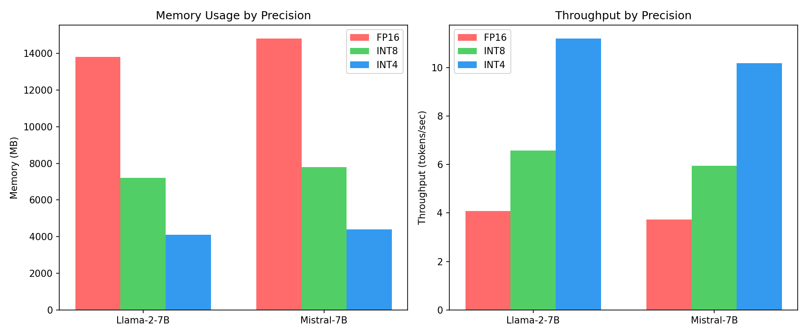

[](https://github.com/tatavishnurao/ml-systems-engineering/actions/workflows/ci.yml)

# Tokenization & Embeddings

> Tested on **Python 3.10+**

A Python library for text tokenization and embeddings with visualization.

## Week 1 - Quantisation & Tokenisation

| Model | Precision | Tokens/s | Peak VRAM (MB) |
|-------|-----------|----------|----------------|
| Llama-2-7B | fp16 | 4.08 | 13,800 |
| Llama-2-7B | INT8 | 6.58 | 7,200 |
| Llama-2-7B | INT4 | 11.19 | 4,100 |
| Mistral-7B | fp16 | 3.73 | 14,800 |
| Mistral-7B | INT8 | 5.94 | 7,800 |
| Mistral-7B | INT4 | 10.18 | 4,400 |



> Scripts: `scripts/plot_speed_mem.py` | Data: `benchmarks/bench_int4.csv`, `benchmarks/bench_int8.csv`

## Getting Started

```bash
pip install -r requirements.txt

# Count tokens in a file
python scripts/count_tokens.py sample_text.txt --model gpt-4

# Generate embeddings
python scripts/dump_embeddings.py sentences.txt --output embeddings.npy

# Visualize embeddings
python scripts/vis_pca.py embeddings.npy --labels labels.txt --output plot.png
```

## What is This?

This library provides two main capabilities:

**Tokenization** - Convert text into tokens (numbers) that LLMs can process
**Embeddings** - Convert text into vectors that capture meaning

## Quick Examples

### Tokenization

```python
from token_emb import TokenizerWrapper

tokenizer = TokenizerWrapper("gpt-4")
tokens = tokenizer.encode("Hello world")
print(tokenizer.count("Hello world"))  # 2 tokens
```

### Embeddings

```python
from token_emb import EmbeddingProvider, cosine_similarity

provider = EmbeddingProvider("all-MiniLM-L6-v2")
emb1 = provider.embed("The cat is sleeping")
emb2 = provider.embed("A dog is resting")
print(cosine_similarity(emb1, emb2))  # High similarity!
```

## CLI Usage

### Count Tokens in a File

```bash
python scripts/count_tokens.py essay.txt --model gpt-4
```

Output:
```
==================================================
File: essay.txt
Model: gpt-4
Backend: tiktoken
==================================================
Token count: 1,247
Character count: 6,582
Avg chars per token: 5.28
==================================================
```

### Generate Embeddings

```bash
python scripts/dump_embeddings.py sentences.txt --output embeddings.npy
```

### Visualize with PCA

```bash
python scripts/vis_pca.py embeddings.npy --labels sentences.txt --output plot.png
```

## Project Structure

```
Tokenization_embeddings/
├── src/token_emb/           # Library code
├── scripts/                 # CLI tools
├── tests/                   # Unit tests
├── benchmarks/              # Benchmark results
├── examples/notebooks/     # Jupyter demo
└── docs/                   # Documentation
```

## Installation

```bash
pip install -r requirements.txt
```

Dependencies:
- numpy, pyyaml (core)
- tiktoken (for OpenAI tokenizers)
- transformers (for HuggingFace models)
- sentence-transformers (for local embeddings)
- matplotlib, scikit-learn (for visualization)

## Testing

```bash
pytest tests/ -v
```

## License

MIT